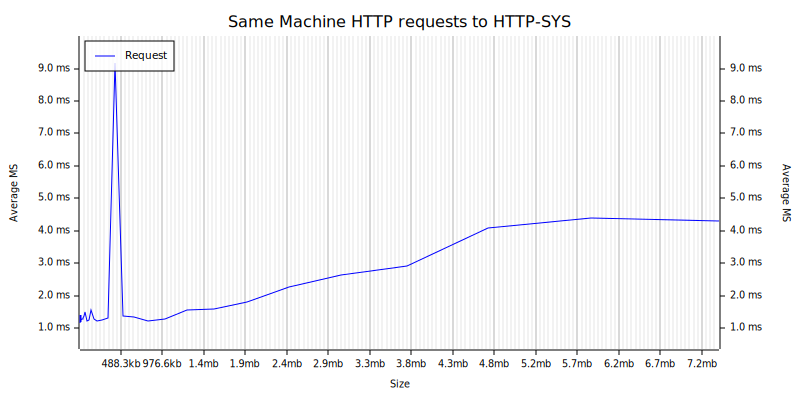

# Rust http-sys tester

A network benchmarking utility that can run as:
  - a server to receive requests
  - a client to send requests and measure latency
  - a per testing framework for self-contained benchmarking

This was used to test the performance of the async http.sys wrapper in [httpsys.rs](src/httpsys.rs) under various conditions.

## Usage: `net-bench.exe <MODE> [OPTIONS] [RECEIVE_URL] [SEND_URL] [PROXY_URL]`

## Mode Commands

*   **server** `<RECEIVE_URL>`: Starts the HTTP server
*   **client** `<SEND_URL> [PROXY_URL]`: Sends requests to the server and measures latency
*   **test**: Starts this app as a server and measures latency

## Arguments

*   `<RECEIVE_URL>`: The URL to receive requests on
*   `<SEND_URL>`: The URL to forward requests to

## Options

*   `-n, --no-validate-certs`: Don't Validate SSL certificates
*   `-h, --help`: Print help
*   `-V, --version`: Print version

## Examples

* `net-bench test`
* `net-bench c https://google.com/`  Client mode calling localhost
* `net-bench c https://google.com/ http://localhost:8080`  Client mode calling localhost via a proxy
* `net-bench s http://localhost:8080`  Server mode receiving on localhost

The server listens on the [url]/test/. If the server was run with:
`net-bench s http://localhost:8080`
it would handle requests on `http://localhost:8080/test`.

In the example above, you need to test latency with:
`net-bench c http://localhost:8080/test/`

You can call the app directly from cargo as follows:
```ps
cargo run -- c https://google.com
Client sending to https://google.com/
Average latency: 183.582809ms
```

Test mode generates results as follows:
